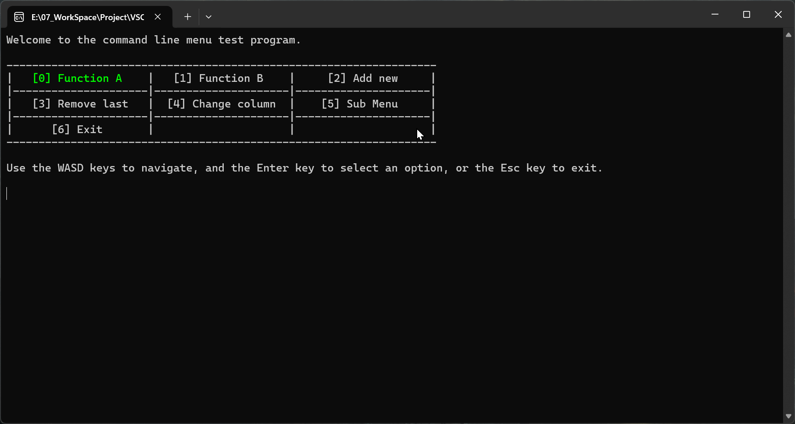
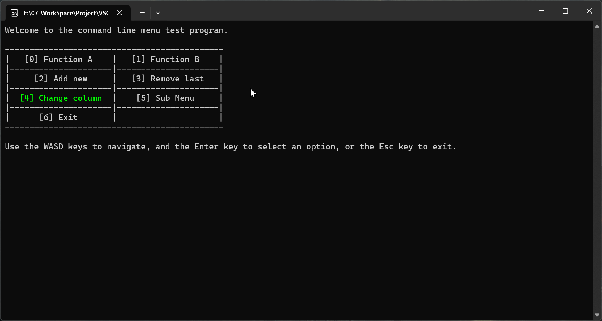
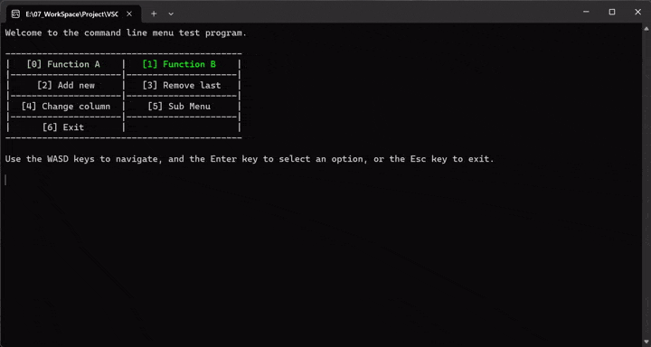

# Command Line Menu

## Brief

A simple console interface for quickly making a more user-friendly console application (A menu, select different options and call corresponding functions by user's input).

## About

### Purpose

I get an order for a student assignment that required the project to provide a console program with user-friendly interface, and this need seemed to be common in student assignments, so this project came into being.

### Open Source

This project is open source and licensed under the MIT license. You can modify, distribute, and use this project as you like, but you must include the copyright, license, and author information in any copies or modifications of the source code.

## Features

1. Only depends on C++11 standard library, and it's a Header-only library, so you can easily include it in your project.
2. Customizable input keys.
3. Customizable background/foreground/highlight colors.
4. Customizable menu layout.
5. Customizable menu appearance.
6. Almost no screen flickers when changing the options.

## Effect Examples

## [command_line_menu_cn.hpp](./include/command_line_menu_cn.hpp) What it is?

This is the source code with Chinese comments.

### Why provide a Chinese commented version?

First of all, this project is only developed by me, and second, although I do not like to add non-ASCII characters in the source code, my English is not very good, which may lead to some English comments have expression problems, so I provide a version of the comments expressed by my mother tongue, Chinese.
